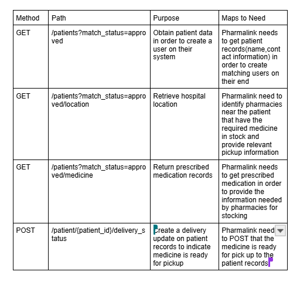

TEAM 2 ENDPOINT LIST

Method |Path |Purpose |Maps to Need | 
 
 
 
GET
/patients?match_status=approved
Obtain patient data in order to create a user on their system
Pharmalink needs to get patient records(name,contact information) in order to create matching users on their end
GET
/patients/{patients_id}/location
Retrieve hospital location
Pharmalink need to identify pharmacies near the patient that have the required medicine in stock and provide relevant pickup information
GET
/patients/{patients_id}/medicine
Return prescribed medication records
Pharmalink needs to get prescribed medication in order to provide the information needed by pharmacies for stocking
POST
/patient/{patient_id}/delivery_status
Create a delivery update on patient records to indicate medicine is ready for pickup
Pharmalink needs to POST that the medicine is ready for pick up to the patient records
PATCH
/patient/{patient_id}/delivery_status
Update an existing delivery
Pharmalink needs to Edit a delivery to confirm if payment is received or delivery has been completed

